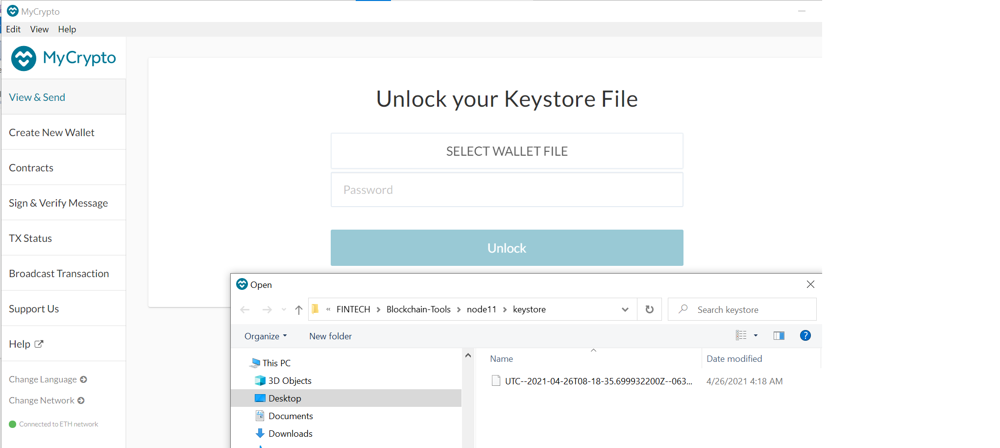

# HOW I BUILT MY PROOF OF AUTHORITY BLOCKCHAIN
 
 ## STEP 1: SETTING BlOCKCHAIN MINNING TOOLS - GO ETHEREUM
THe Go Ethereum Tools is one of the three original implementations of the Ethereum protocol. It is written in Go, fully open-source and licensed under the GNU LGPL v3.

In order to be able to build the POA, we will need to install the following tools

•  `Puppeth` - to generate the genesis block

•  `Geth` - a command-line tool to create keys, initialize nodes, and connect the nodes together

•  The `Clique` Proof of Authority algorithm.

The `Proof of Authority (PoA)` algorithm is typically used for private blockchain networks as it requires pre-approval of, or voting in of, the account addresses that can approve transactions (seal blocks).

Below are the steps to follows to install the GO Ethereum tools

 (1) Open your browser and navigate to the Go Ethereum Tools download page at https://geth.ethereum.org/downloads/

 (2) Scroll down to the "Stable Releases" section and proceed depending on your operating system. Depending on the OS and the version of the Windows version, you should download the 32 bit or 64 bit version of the Go Ethereum Tools.

 (3) After downloading the tools archive, open your "Downloads" folder, and you will find a file named geth-alltools-darwin-amd64-1.9.7-a718daa6.tar.gz in OS X, and a file called geth-alltools-windows-amd64-1.9.7-a718daa6.zip in Windows. Note that the last numbers in the filename could vary depending on the last built available.
 
 (4) Decompress the archive in the location of your preference in your computer's hard drive, and rename the containing folder as Blockchain-Tools. We recommend using a location that can be easily accessed from the terminal window like the user's home directory.

 
 (5)  You have finished the installation process; you will use these tools to create your very own blockchain!

# STEP2: SETUP THE POA BLOCKCHAIN ENVIRONMENT

The following are instructions in setting up the Proof of Authority (PoA)

# Instructions

## STEP 2A: Generate Blockchain Nodes
Generate two new nodes with new account addresses that will serve as the pre-approved sealer addresses using the Geth to create two nodes. For my purpose of demonstration i created  **Node 11** and **Node 22** by running the following commands  terminals such as Git Bash:

**Create Node 11:**

`./geth --datadir node11 account new`

**Create Node 22:**

`./geth --datadir node2 account new`

It is expected that you have to run these commands from the folder in which you have Geth installed. Once the two nodes have been generated, there will be two folders created – `node11` and `node22` – each containing a folder with a keystore for that node.

## Generate your Genesis Block
Next use **puppeth** to generate the genesis block following the procedure below:

- Run `puppeth`, name your network, and select the option to `configure a new genesis block`. I named my PoA network `samchain`.

- Choose the `Clique` (Proof of Authority) consensus algorithm.

- Paste both account addresses from the first step one at a time into the list of accounts to seal.

- Paste both accounts again in the list of accounts to pre-fund. This is required since there are no block rewards in PoA.

- Choose no for pre-funding the pre-compiled accounts (0x1 .. 0xff) with wei.

- Complete the rest of the prompts, and when you are back at the main menu, choose the "Manage existing genesis" option.

- Export genesis configurations. This will fail to create two of the files, but we only need  the json for the name of your network and specifically for my network being `samchain.json`.

## Initialize the Nodes with the Genesis' Json File

Using geth,initialize each node with the new `samchain.json`.

Open two  terminals such as Git Bash windows, one for Node 11 and the other for Node 22, and run the following commands:

`./geth --datadir node11 init samchain.json`

`./geth --datadir node22 init samchain.json`

### KEYWORDS TO NOTE
 node11                                               ------This is the name of the Blockchain Nodes for the new account  i created
 
 node22                            ---------- This is the name of the 2nd Blockchain Nodes for the 2nd new account  i created
 
 init                               ----- ---Bootstrap and initialize a new genesis block
 
 samchain.json                     -------- The json file of the network name i created.
 
--datadir                          --------- Data directory for the databases and keystore (default: "~/.ethereum")

## Begin Mining Blocks

Run the nodes in the  two separate terminal  that were opened in the above step with the commands:

`./geth --datadir node11 --unlock "SEALER_ONE_ADDRESS" --mine --rpc --allow-insecure-unlock`

`./geth --datadir node22 --unlock "SEALER_TWO_ADDRESS" --mine --port 30304 --bootnodes "enode://SEALER_ONE_ENODE_ADDRESS@127.0.0.1:30303" --ipcdisable --allow-insecure-unlock`

**NOTE**: Type your password and hit enter - even if you can't see it visually!

The PoA blockchain should be now up and running.

## STEP3: Add the New Blockchain to MyCrypto for Testing

- Open the `MyCrypto` app, then click Change Network at the bottom left
- Click "Add Custom Node", then add the custom network information that you set in the genesis.
- Make sure that you scroll down to choose Custom in the "Network" column to reveal more options like Chain ID:

- Type `ETH` in the Currency box.
- In the Chain ID box, type the chain id you generated during genesis creation. 
- In the URL box type: `http://127.0.0.1:8545`.  This points to the default RPC port on your local machine.

- Finally, click `Save & Use Custom Node`.

## After connecting to the custom network in MyCrypto, it can be tested by sending money between accounts.

- Select the View & Send option from the left menu pane, then click Keystore file.

- On the next screen, click Select `Wallet File`, then navigate to the keystore directory inside your Node11 directory, select the file located there, provide your password when prompted and then click `Unlock`.

- This will open your account wallet inside MyCrypto.

- You will see that your account has a huge balance. This is the balance that was pre-funded for this account in the genesis configuration; however, these millions of ETH tokens are just for testing purposes.

- In the To Address box, type the account address from Node22, then fill in an arbitrary amount of ETH:

- Confirm the transaction by clicking "Send Transaction", and the "Send" button in the pop-up window.

- Click the Check TX Status when the green message pops up, confirm the logout:

- You should see the transaction go from Pending to Successful in around the same blocktime you set in the genesis.

- You can click the Check TX Status button to update the status.

- This confirms that you have successfully created your own private blockchain!
